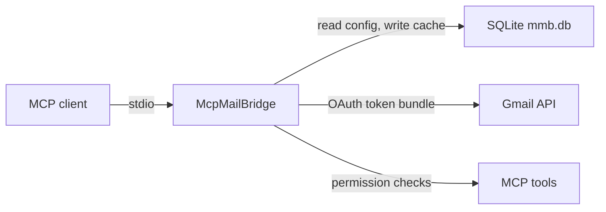

# McpMailBridge

McpMailBridge is a local MCP server for mail accounts. It runs over stdio, stores account state in SQLite, and checks account permissions before it lists, reads, sends, or changes mail.

## Status

| Area | Current state |
| --- | --- |
| Transport | MCP over stdio |
| Database | SQLite file, `mmb.db` next to the executable by default |
| Working provider | Gmail with OAuth token bundles |
| Config-only providers | IMAP/SMTP and Microsoft 365 are modeled but not wired to mail transport |
| Local UI | Interactive terminal UI for account management |

## How It Fits Together



## Requirements

- Rust toolchain with edition 2024 support.
- Google OAuth client credentials for Gmail device login.
- An MCP client that can launch a stdio server.

## Quick Start

Build and verify the project:

```sh
cargo build
cargo test
cargo fmt --check
cargo clippy --all-targets --all-features -- -D warnings
```

Create or edit accounts:

```sh
cargo run -- config add
cargo run -- config list
cargo run -- config edit <account-id>
cargo run -- config remove <account-id>
cargo run -- config check
```

Run the server:

```sh
cargo run -- serve
```

Open the terminal UI:

```sh
cargo run -- tui
```

Use a separate local database when testing:

```sh
cargo run -- --database ./.local/dev.mmb.db serve
```

## Account Setup

Account data lives in SQLite. Use `--database <path>` to point the CLI or server at another database file.

For Gmail, use these values when prompted:

| Field | Value |
| --- | --- |
| Provider | `gmail` |
| Auth kind | `oauth_token` |
| Account id | A local alias such as `work` or `personal` |

The account id is not the Gmail address. MCP clients pass the alias as `account_id`.

`cargo run -- config add` can run Google's device OAuth flow and store the token bundle. You can also paste an existing local OAuth token bundle when prompted.

`expires_at_unix` is optional in pasted OAuth token bundles. When a bundle includes `access_token` but omits `expires_at_unix`, McpMailBridge treats the cached access token as stale and refreshes immediately with the refresh token. When `expires_at_unix` is present, the cached access token is used only if it remains valid for more than the 60-second refresh safety window.

Store token bundle JSON only through the CLI or TUI prompt so it lands in the local SQLite database. If `token_uri` is present, it must be `https://oauth2.googleapis.com/token`; custom token endpoints are rejected before refresh credentials are used so they are not sent to non-Google hosts. Do not paste real tokens into chat, README examples, Linear, GitHub, logs, or tracked files.

## MCP Client Config

Use stdio transport:

```json
{
  "mcpServers": {
    "mcp-mail-bridge": {
      "command": "cargo",
      "args": ["run", "--", "--database", "./mmb.db", "serve"]
    }
  }
}
```

This config contains no credentials. Credentials stay in SQLite.

## MCP Tools

| Tool | Permission | Purpose |
| --- | --- | --- |
| `list_accounts` | None | Lists configured accounts without secrets. |
| `list_messages` | `search` | Lists bounded message summaries. |
| `read_message` | `read` | Reads one selected message body. |
| `send_message` | `send` | Sends one message from the account. |
| `mark_as_read` | `mark_as_read` | Marks one selected message as read. |
| `mark_as_unread` | `mark_as_unread` | Marks one selected message as unread. |

Compatibility rules:

- Stored `read` permission also allows summary listing.
- Legacy stored `write` permission loads as `send`.

## Message Requests

`list_messages` requires `account_id`.

Optional filters:

| Field | Notes |
| --- | --- |
| `query` | Provider search query. |
| `label` | Gmail label such as `INBOX`, `SENT`, or a label id. |
| `start_unix`, `end_unix` | Supply both bounds together. |
| `read_state` | `read` or `unread`. |
| `limit` | Defaults to 25 and clamps to 1-50. |
| `page_token` | Provider pagination token. |

Window rules:

- No time window means the last 30 days.
- A single time bound is rejected.
- Windows wider than 90 days are rejected.
- Listing returns summaries only. `read_message` fetches a body only for the requested `message_id`.

## Sending Mail

`send_message` requires:

- `account_id`
- `to`
- `subject`
- non-empty `body`

Optional fields:

- `cc`
- `bcc`
- `body_format`

Supported body formats:

| Input | Sent as |
| --- | --- |
| `text/plain` | Plain text |
| `plain` | Plain text |
| `text/html` | HTML |
| `html` | HTML |

Recipient and header fields reject control characters, line breaks, non-ASCII header text, and malformed recipient addresses.

## Cache Behavior

McpMailBridge caches bounded message lists, selected message bodies, remote version markers, and read state in SQLite.

| Situation | Behavior |
| --- | --- |
| Gmail is temporarily unavailable | Falls back to compatible cached data when available. |
| Network transport fails | Falls back to compatible cached data when available. |
| Authentication fails | Returns an error. |
| Account identity does not match | Returns an error. |
| Request is rejected | Returns an error. |
| Message is missing | Returns an error. |

Cached responses set `source` to `gmail-cache`.

## Development Notes

- Keep MCP transport on stdio unless a human explicitly asks for another transport.
- Keep local notes and development databases under `.local/`.
- Keep credentials, local databases, logs, screenshots, and scratch output out of git.
- Add dependencies with exact versions, for example `cargo add crate@=x.y.z`.

## Secrets

Do not put real tokens, OAuth client secrets, mailbox content, or `mmb.db` files in git, chat, issues, pull requests, logs, or docs.

## License

See [LICENSE](LICENSE).
